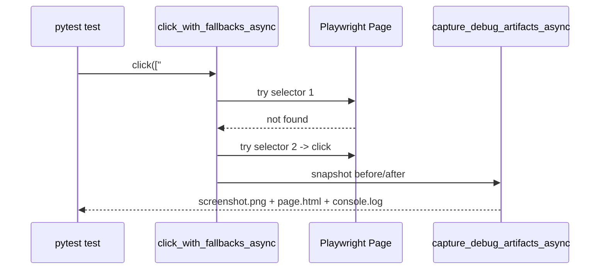

# scitex-browser

<p align="center">
  <a href="https://scitex.ai">
    
  </a>
</p>

<p align="center"><b>Playwright wrappers for scholarly paper access — popup handling, PDF capture, failure-replay screenshots, stealth browsing.</b></p>

<p align="center">
  <a href="https://scitex-browser.readthedocs.io/">Full Documentation</a> · <code>pip install scitex-browser</code>
</p>

<!-- scitex-badges:start -->
<p align="center">
  <a href="https://pypi.org/project/scitex-browser/"></a>
  <a href="https://pypi.org/project/scitex-browser/"></a>
  <a href="https://github.com/ywatanabe1989/scitex-browser/actions/workflows/test.yml"></a>
  <a href="https://github.com/ywatanabe1989/scitex-browser/actions/workflows/install-test.yml"></a>
  <a href="https://codecov.io/gh/ywatanabe1989/scitex-browser"></a>
  <a href="https://scitex-browser.readthedocs.io/en/latest/"></a>
  <a href="https://www.gnu.org/licenses/agpl-3.0"></a>
</p>
<!-- scitex-badges:end -->

---

## Problem and Solution

| # | Problem | Solution |
|---|---------|----------|
| 1 | **Playwright is great but verbose** -- every scraping script reinvents popup dismissal, retry logic, Chrome-PDF-viewer workaround | **Helpers**: `click_with_fallbacks_async([sel1, sel2])`, `save_as_pdf_async`, `close_popups_async`, `inject_visual_effects` — focused wrappers around Playwright |
| 2 | **Tests fail silently with no artifact** -- `pytest-playwright` doesn't auto-capture screen + DOM on failure | **`TestMonitor` + `create_failure_capture_fixture`** -- captures screenshot + page HTML + console log on every failure |

## Features

- **Debugging**: Visual cursor feedback, popup logging, failure capture, test monitoring
- **PDF**: Chrome PDF viewer detection, save-as-PDF automation
- **Interaction**: Click/fill with fallbacks, popup handling
- **Stealth**: Human-like behavior simulation, stealth browser management
- **Remote**: ZenRows API integration, CAPTCHA handling
- **Collaboration**: Shared browser sessions, credential management
- **Auth**: Google authentication helpers

## Installation

```bash
pip install scitex-browser
```

## Architecture

```
scitex-browser/
├── src/scitex_browser/
│   ├── __init__.py              # save_as_pdf, click_with_fallbacks_async, ...
│   ├── debugging/               # TestMonitor, capture_debug_artifacts_async
│   │   ├── _capture.py          # screenshot + HTML + console artifacts
│   │   └── _monitor.py          # pytest-playwright failure hook
│   ├── stealth/                 # StealthManager + playwright-stealth glue
│   ├── remote/                  # ZenRows API + CAPTCHA handling
│   ├── auth/                    # Google + shared-session helpers
│   └── pdf/                     # Chrome-PDF-viewer detection, save_as_pdf
└── tests/                       # pytest-playwright suite
```

### Optional extras

```bash
pip install scitex-browser[stealth]   # playwright-stealth
pip install scitex-browser[remote]    # ZenRows integration
pip install scitex-browser[scitex]    # Full SciTeX integration
```

## Quick start

```python
from scitex_browser import save_as_pdf, browser_logger
from scitex_browser.stealth import StealthManager
```

## 1 Interfaces

<details open>
<summary><strong>Python API</strong></summary>

<br>

```python
from scitex_browser import (
    save_as_pdf, save_as_pdf_async,
    click_with_fallbacks_async, close_popups_async,
    inject_visual_effects, browser_logger,
)
from scitex_browser.stealth import StealthManager
from scitex_browser.debugging import (
    TestMonitor, create_failure_capture_fixture,
    capture_debug_artifacts_async,        # screenshot + HTML in one call
)
```

`click_with_fallbacks_async` and `fill_with_fallbacks_async` capture
screenshot + HTML before/after every call by default
(`capture_debug=True`). Drop `capture_debug=False` only in tight
loops. See `_skills/scitex-browser/11_debugging-visuals.md` for the
full pattern.

</details>

## Demo



## Part of SciTeX

`scitex-browser` is part of [**SciTeX**](https://scitex.ai). Install via
the umbrella with `pip install scitex[browser]` to use as
`scitex.browser` (Python) or `scitex browser ...` (CLI).

>Four Freedoms for Research
>
>0. The freedom to **run** your research anywhere — your machine, your terms.
>1. The freedom to **study** how every step works — from raw data to final manuscript.
>2. The freedom to **redistribute** your workflows, not just your papers.
>3. The freedom to **modify** any module and share improvements with the community.
>
>AGPL-3.0 — because we believe research infrastructure deserves the same freedoms as the software it runs on.

## License

AGPL-3.0. See [LICENSE](LICENSE) for details.

---

<p align="center">
  <a href="https://scitex.ai" target="_blank"></a>
</p>
